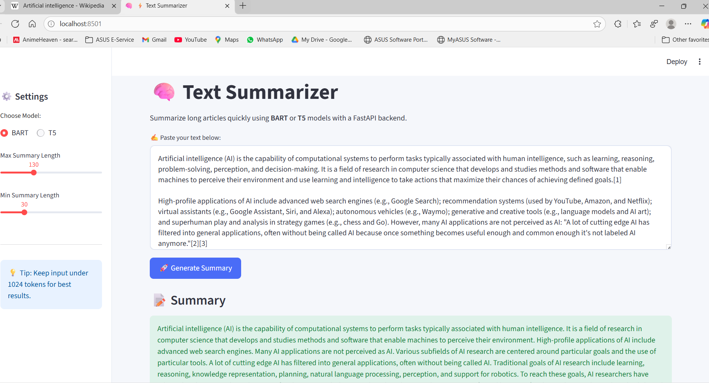
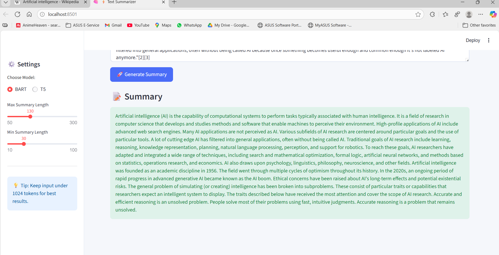

# ⚡ Text Summarization using FastAPI + Streamlit

A lightweight and optimized **Text Summarization Web App** built using:

- 🧠 Hugging Face Transformers (BART & T5)
- 🚀 FastAPI backend
- 🎨 Streamlit frontend UI
- ⚡ Async processing & intelligent text chunking

---

## 📂 Project Structure
```
📁 TEXT_SUMMARIZATION
│
├── backend/
│   ├── main.py          # FastAPI server
│   
│
└── frontend/
    ├── app.py           # Streamlit UI   
```

---

## 🔧 Installation & Setup

### 1️⃣ Create Virtual Environment (Recommended)
```sh
python -m venv venv
source venv/bin/activate   # Linux/Mac
venv\Scripts\activate      # Windows
```

### 2️⃣ Install Dependencies
Inside `backend` folder:
```sh
pip install fastapi uvicorn transformers torch
```

Inside `frontend` folder:
```sh
pip install streamlit requests
```

> 📝 Ensure Python 3.10 or above is installed.

---

## ▶️ Run the Application

📌 Step–1: Start FastAPI backend
```sh
cd backend
uvicorn main:app --reload --port 8000
```

📌 Step–2: Start Streamlit frontend
```sh
cd ../frontend
streamlit run app.py
```


Then open your browser automatically or go to:
```
http://localhost:8501
```


## 🚀 Features
- Summarize long articles with **BART** or **T5** models
- Uses **lazy model loading** for faster startup
- Chunking algorithm to support long text
- Streamlit UI with clean and modern design
- Async execution to avoid blocking UI

---

## 📌 Usage
1. Paste large text in the input box
2. Select model: BART or T5
3. Adjust summary length (Max/Min)
4. Click **"Generate Summary"**
5. View final summarized output


## UI


